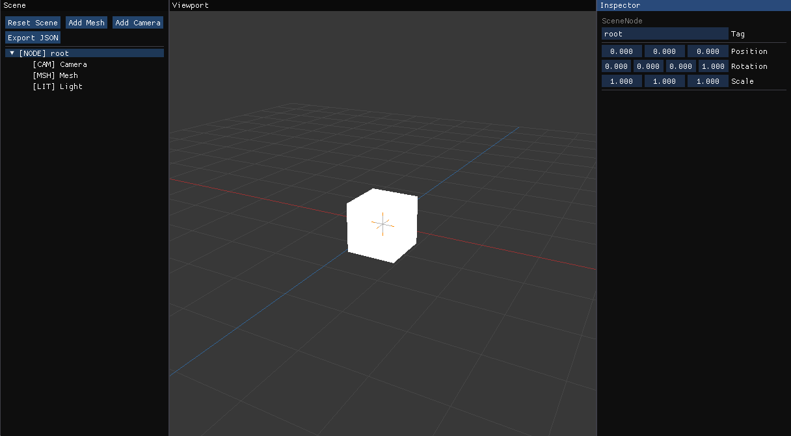

# Scene Orchestrator

A small desktop 3D scene editor. Build a node hierarchy, tweak transforms, and see the result live in a 3D viewport.



## Running

```
dotnet run --project SceneOrchestrator.App
```

## Layout

The window has three fixed panels:

- **Scene** (left) — the node tree and action buttons
- **Viewport** (center) — live 3D view
- **Inspector** (right) — properties of the selected node

## Scene Panel

| Button | What it does |
|---|---|
| Reset Scene | Wipes the current scene and rebuilds the default (Camera + Mesh + Light) |
| Add Mesh | Adds a Mesh node as a child of the selected node |
| Add Camera | Adds a Camera node as a child of the selected node |
| Add Light | Adds a Light node as a child of the selected node |
| Export JSON | Saves the whole scene to `scene.json` in the working directory |

Click any node in the tree to select it. Nodes are labelled by type: `[CAM]`, `[LIT]`, `[MSH]`, `[NODE]`.

## Inspector Panel

Shows editable fields for the selected node:

- **Tag** — rename the node
- **Position / Rotation / Scale** — drag to edit the local transform
- **Type-specific fields** — see below
- **Delete Node** — removes the node from its parent (not available on root)

### Camera fields
| Field | Description |
|---|---|
| Projection | Perspective or Orthographic |
| Field Of View | Vertical FOV in radians |
| Near / Far Plane | Clipping distances |
| Aspect Ratio | Width ÷ height |

### Light fields
| Field | Description |
|---|---|
| Type | Point, Directional, or Spot |
| Intensity | Brightness multiplier |
| Decay | Attenuation factor |
| Color | RGB color picker |
| Cutoff Angle | Cone half-angle in radians (Spot only) |

### Mesh fields
| Field | Description |
|---|---|
| Mesh Path | Asset path string (display only — no mesh is loaded at runtime) |

## Viewport Controls

| Input | Action |
|---|---|
| Right-drag | Orbit the camera |
| Middle-drag | Pan the camera |
| Scroll wheel | Zoom in / out |

The viewport shows a reference grid, an axis-cross gizmo at each node's world position, and Mesh nodes as white placeholder cubes.

## Exporting

Click **Export JSON** to write `scene.json` to the current working directory. The file captures the full node hierarchy including transforms and all type-specific properties. A status line appears below the button confirming success or showing an error.

## Running Tests

```
dotnet test SceneOrchestrator.slnx
```
